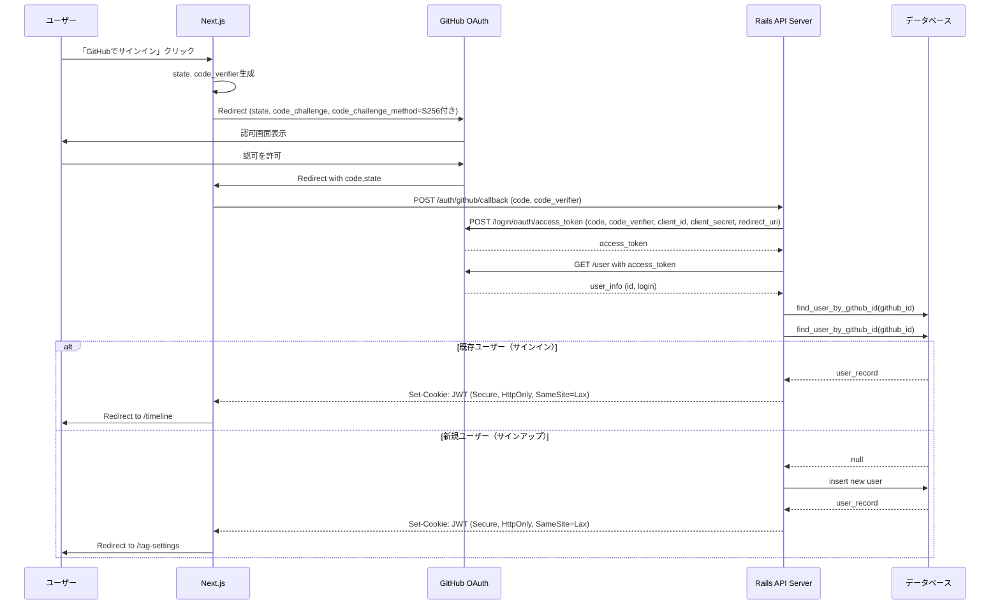

# サインインフロー

```mermaid
sequenceDiagram
    participant User as ユーザー
    participant Frontend as Next.js
    participant GitHub as GitHub OAuth
    participant RailsAPI as Rails API Server
    participant DB as データベース

    User ->> Frontend: 「GitHubでサインイン」クリック
    Frontend ->> Frontend: state, code_verifier生成
    Frontend ->> GitHub: Redirect (state, code_challenge, code_challenge_method=S256付き)
    GitHub ->> User: 認可画面表示
    User ->> GitHub: 認可を許可
    GitHub ->> Frontend: Redirect with code,state
    Frontend ->> RailsAPI: POST /auth/github/callback (code, code_verifier)
    RailsAPI ->> GitHub: POST /login/oauth/access_token (code, code_verifier, client_id, client_secret, redirect_uri)
    GitHub -->> RailsAPI: access_token
    RailsAPI ->> GitHub: GET /user with access_token
    GitHub -->> RailsAPI: user_info (id, login)
    RailsAPI ->> DB: find_user_by_github_id(github_id)
    RailsAPI ->> DB: find_user_by_github_id(github_id)
    alt 既存ユーザー（サインイン）
        DB -->> RailsAPI: user_record
        RailsAPI -->> Frontend: Set-Cookie: JWT (Secure, HttpOnly, SameSite=Lax)
        Frontend ->> User: Redirect to /timeline
    else 新規ユーザー（サインアップ）
        DB -->> RailsAPI: null
        RailsAPI ->> DB: insert new user
        DB -->> RailsAPI: user_record
        RailsAPI -->> Frontend: Set-Cookie: JWT (Secure, HttpOnly, SameSite=Lax)
        Frontend ->> User: Redirect to /tag-settings
    end
```
