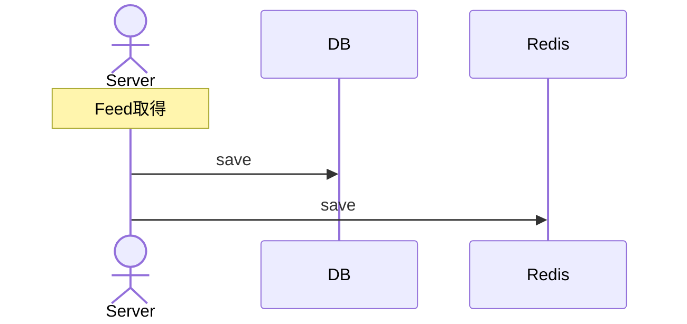

# キャッシュ戦略

キャッシュの運用方針を決める。

## キャッシュ対象

キャッシュは通常頻繫にアクセスするデータに対して行う。
今回もこの考えに則り、頻繁にアクセスするであろう以下のテーブルのレコードをキャッシュする

* Feed
* Repository
* Tag

一番頻繁にアクセスするのはFeedであるが、FeedはRepositoryやTagに対するassociationを持っているのでこれらも同様にキャッシュする。

## キャッシュ運用フロー

### 候補

キャッシュは大きく以下の二つの手法が存在する

**遅延読み込み**

必要な時にのみキャッシュにデータをロードする方式。
つまり、あるデータに初回アクセスしたときはDBにアクセスし、そのタイミングでキャッシュにデータを置くことで次回以降の処理を高速化しようというもの。

**書き込みスルー**

データを作成する段階で全部のレコードをキャッシュに乗せてしまう方式。
初回実行時も処理速度が速いが、無駄なデータを持つ可能性がある。

### 選定

サーバーの処理速度の弱さをカバーしたいという意図があるため、速度を重視して**書き込みスルー**を採用する。容量面でのデメリットはTTLを2週間で設定して緩和する。

### 実フロー

詳細は非同期ジョブフローを確認してもらいたいが、非同期ジョブでFeedを取得してきたタイミングでRedisに書き込む。

