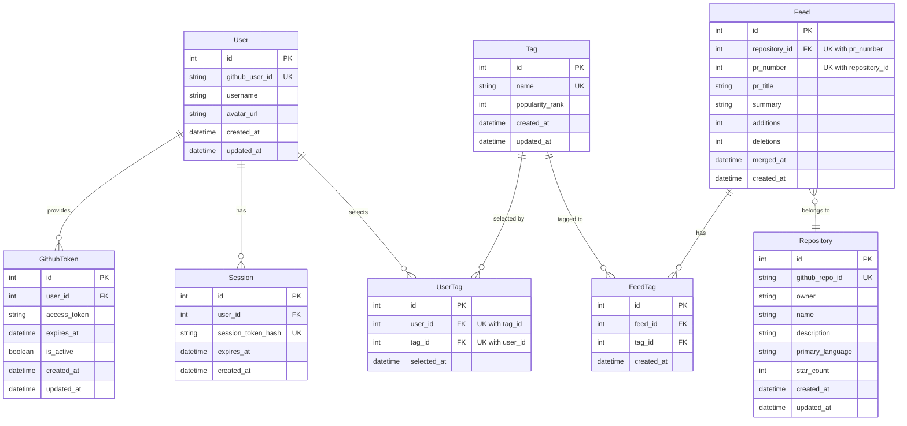

```mermaid
erDiagram
    User ||--o{ UserTag : "selects"
    User ||--o{ Session : "has"
    User ||--o{ GithubToken : "provides"
    Feed }o--|| Repository : "belongs to"
    Feed ||--o{ FeedTag : "has"
    Tag ||--o{ FeedTag : "tagged to"
    Tag ||--o{ UserTag : "selected by"

    User {
        int id PK
        string github_user_id UK
        string username
        string avatar_url
        datetime created_at
        datetime updated_at
    }

    GithubToken {
        int id PK
        int user_id FK
        string access_token
        datetime expires_at
        boolean is_active
        datetime created_at
        datetime updated_at
    }

    Tag {
        int id PK
        string name UK
        int popularity_rank
        datetime created_at
        datetime updated_at
    }

    UserTag {
        int id PK
        int user_id FK "UK with tag_id"
        int tag_id FK "UK with user_id"
        datetime selected_at
    }

    Session {
        int id PK
        int user_id FK
        string session_token_hash UK
        datetime expires_at
        datetime created_at
    }

    Repository {
        int id PK
        string github_repo_id UK
        string owner
        string name
        string description
        string primary_language
        int star_count
        datetime created_at
        datetime updated_at
    }

    Feed {
        int id PK
        int repository_id FK "UK with pr_number"
        int pr_number "UK with repository_id"
        string pr_title
        string summary
        int additions
        int deletions
        datetime merged_at
        datetime created_at
    }

    FeedTag {
        int id PK
        int feed_id FK
        int tag_id FK
        datetime created_at
    }
```
