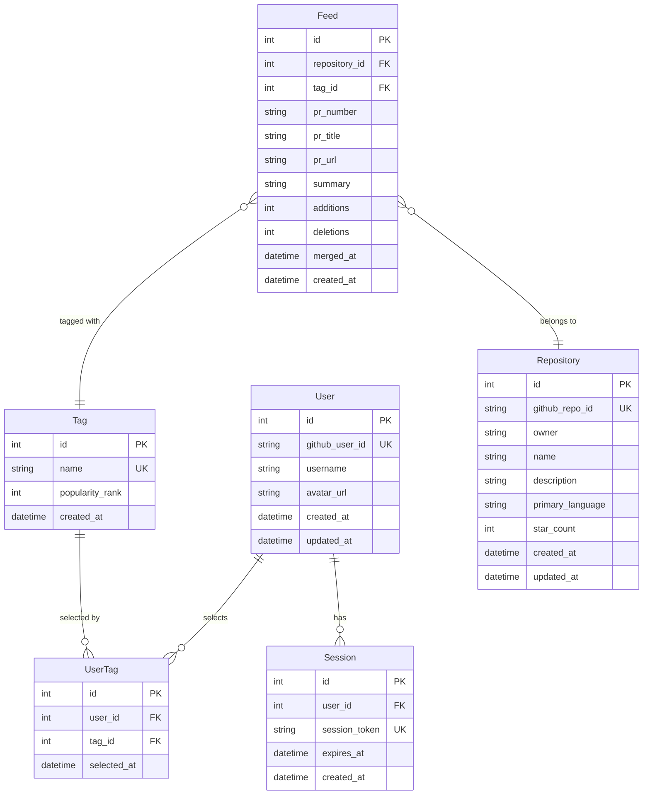

```mermaid
erDiagram
    User ||--o{ UserTag : "selects"
    Tag ||--o{ UserTag : "selected by"
    User ||--o{ Session : "has"
    Feed }o--|| Repository : "belongs to"
    Feed }o--|| Tag : "tagged with"

    User {
        int id PK
        string github_user_id UK
        string username 
        string avatar_url
        datetime created_at
        datetime updated_at
    }

    Tag {
        int id PK
        string name UK
        int popularity_rank
        datetime created_at
    }

    UserTag {
        int id PK
        int user_id FK
        int tag_id FK
        datetime selected_at
    }

    Session {
        int id PK
        int user_id FK
        string session_token UK 
        datetime expires_at 
        datetime created_at 
    }

    Repository {
        int id PK
        string github_repo_id UK
        string owner
        string name
        string description
        string primary_language
        int star_count
        datetime created_at
        datetime updated_at
    }

    Feed {
        int id PK
        int repository_id FK
        int tag_id FK
        string pr_number 
        string pr_title 
        string pr_url 
        string summary 
        int additions 
        int deletions
        datetime merged_at
        datetime created_at 
    }
```