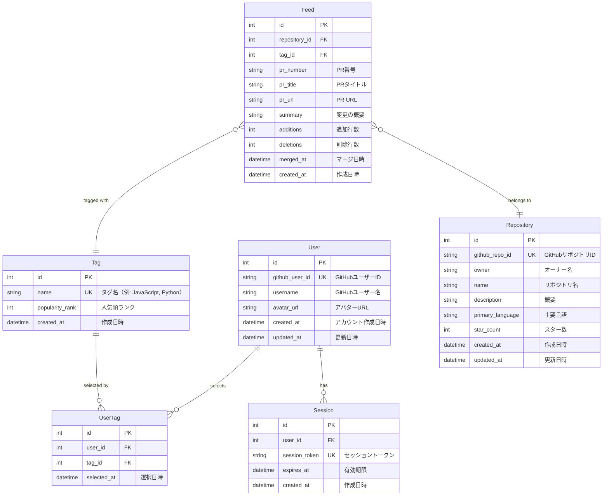

```mermaid
erDiagram
    User ||--o{ UserTag : "selects"
    Tag ||--o{ UserTag : "selected by"
    User ||--o{ Session : "has"
    Feed }o--|| Repository : "belongs to"
    Feed }o--|| Tag : "tagged with"

    User {
        int id PK
        string github_user_id UK "GitHubユーザーID"
        string username "GitHubユーザー名"
        string avatar_url "アバターURL"
        datetime created_at "アカウント作成日時"
        datetime updated_at "更新日時"
    }

    Tag {
        int id PK
        string name UK "タグ名（例: JavaScript, Python）"
        int popularity_rank "人気順ランク"
        datetime created_at "作成日時"
    }

    UserTag {
        int id PK
        int user_id FK
        int tag_id FK
        datetime selected_at "選択日時"
    }

    Session {
        int id PK
        int user_id FK
        string session_token UK "セッショントークン"
        datetime expires_at "有効期限"
        datetime created_at "作成日時"
    }

    Repository {
        int id PK
        string github_repo_id UK "GitHubリポジトリID"
        string owner "オーナー名"
        string name "リポジトリ名"
        string description "概要"
        string primary_language "主要言語"
        int star_count "スター数"
        datetime created_at "作成日時"
        datetime updated_at "更新日時"
    }

    Feed {
        int id PK
        int repository_id FK
        int tag_id FK
        string pr_number "PR番号"
        string pr_title "PRタイトル"
        string pr_url "PR URL"
        string summary "変更の概要"
        int additions "追加行数"
        int deletions "削除行数"
        datetime merged_at "マージ日時"
        datetime created_at "作成日時"
    }
```