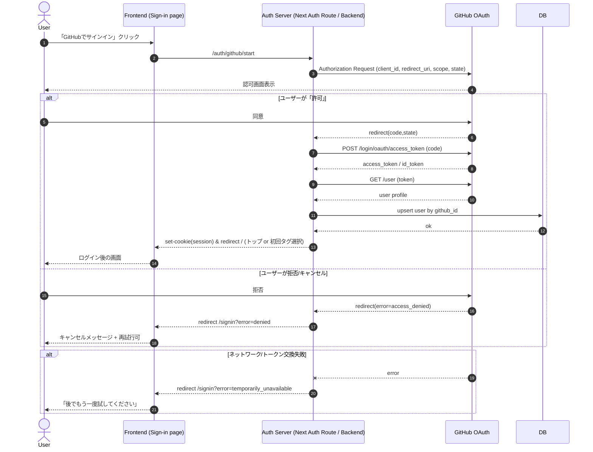

```mermaid
sequenceDiagram
  autonumber
  actor User as User
  participant FE as Frontend (Sign-in page)
  participant Auth as Auth Server (Next Auth Route / Backend)
  participant GH as GitHub OAuth
  participant DB as DB

  User->>FE: 「GitHubでサインイン」クリック
  FE->>Auth: /auth/github/start
  Auth->>GH: Authorization Request (client_id, redirect_uri, scope, state)
  GH-->>User: 認可画面表示

  alt ユーザーが「許可」
    User->>GH: 同意
    GH-->>Auth: redirect(code,state)
    Auth->>GH: POST /login/oauth/access_token (code)
    GH-->>Auth: access_token / id_token
    Auth->>GH: GET /user (token)
    GH-->>Auth: user profile
    Auth->>DB: upsert user by github_id
    DB-->>Auth: ok
    Auth-->>FE: set-cookie(session) & redirect / (トップ or 初回タグ選択)
    FE-->>User: ログイン後の画面

  else ユーザーが拒否/キャンセル
    User->>GH: 拒否
    GH-->>Auth: redirect(error=access_denied)
    Auth-->>FE: redirect /signin?error=denied
    FE-->>User: キャンセルメッセージ + 再試行可
  end

  alt ネットワーク/トークン交換失敗
    GH--x Auth: error
    Auth-->>FE: redirect /signin?error=temporarily_unavailable
    FE-->>User: 「後でもう一度試してください」
  end
```