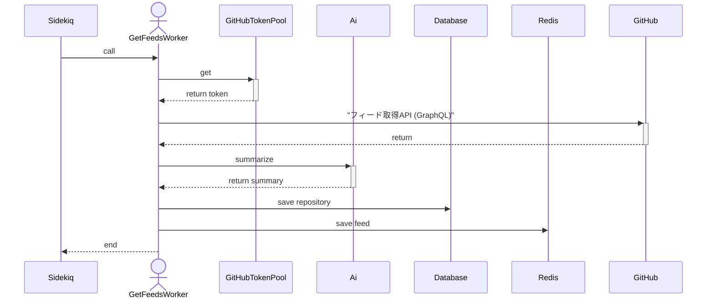

# フィード取得関係
フィードの取得ジョブでは主に以下の2つをGitHubから取得する。

* 人気のRepository
* 上記Repositoryの最新Feed

非同期ジョブなので、実行速度はあまり考慮しない

## フィードの取得ジョブ

```mermaid
sequenceDiagram

  participant Sidekiq
  actor GetFeedsWorker
  participant GitHubTokenPool
  participant Ai
  participant Database
  participant Redis
  participant GitHub

  Sidekiq->>GetFeedsWorker: call
  GetFeedsWorker->>+GitHubTokenPool: get
  GitHubTokenPool-->>-GetFeedsWorker: return token
  GetFeedsWorker->>+GitHub: "フィード取得API (GraphQL)"
  GitHub-->>-GetFeedsWorker: return
  GetFeedsWorker->>+Ai: summarize
  Ai-->>-GetFeedsWorker: return summary
  GetFeedsWorker->>Database: save repository
  GetFeedsWorker->>Redis: save feed
  GetFeedsWorker-->>Sidekiq: end
```

## ジョブ実行周期

WIP
