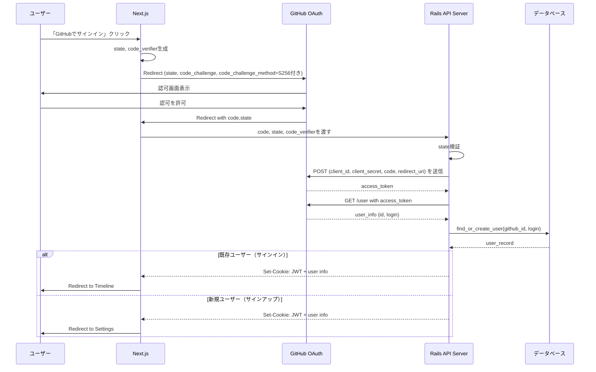

```mermaid
sequenceDiagram
    participant User as ユーザー
    participant Frontend as Next.js
    participant GitHub as GitHub OAuth
    participant API as Rails API Server
    participant DB as データベース

    User ->> Frontend: 「GitHubでサインイン」クリック
    Frontend ->> Frontend: state, code_verifier生成
    Frontend ->> GitHub: Redirect (state, code_challenge, code_challenge_method=S256付き)
    GitHub ->> User: 認可画面表示
    User ->> GitHub: 認可を許可
    GitHub ->> Frontend: Redirect with code,state
    Frontend ->> API: code, state, code_verifierを渡す
    API ->> API: state検証
    API ->> GitHub: POST (client_id, client_secret, code, redirect_uri) を送信
    GitHub -->> API: access_token
    API ->> GitHub: GET /user with access_token
    GitHub -->> API: user_info (id, login)
    API ->> DB: find_or_create_user(github_id, login)
    DB -->> API: user_record
    alt 既存ユーザー（サインイン）
        API -->> Frontend: Set-Cookie: JWT + user info
        Frontend ->> User: Redirect to Timeline
    else 新規ユーザー（サインアップ）
        API -->> Frontend: Set-Cookie: JWT + user info
        Frontend ->> User: Redirect to Settings
    end
```
